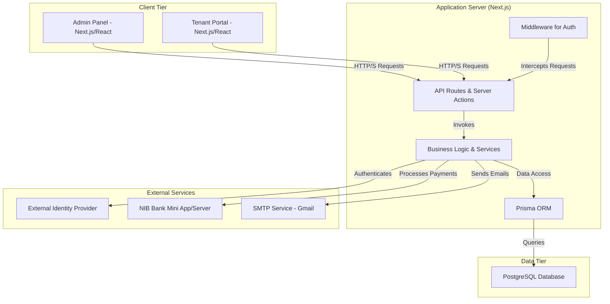

# High-Level Design: NIB Building Management Solution

## 1. Introduction

This document outlines the high-level architecture and design principles for the NIB Building Management Solution. The system is a modern, multi-tenant web application designed to streamline property management tasks, from tenant onboarding to automated billing and payment processing.

## 2. System Overview

The application is a monolithic Next.js application using a server-centric architecture with Server Components and Server Actions. It provides two primary interfaces:

1.  **Admin Panel**: A comprehensive backend for property managers, accountants, and administrators to manage all aspects of the rental business.
2.  **Tenant Portal**: A secure, self-service portal for tenants to view their bills, track payment history, and communicate with management.

The system is designed to integrate with an external identity provider for user authentication and with the NIB Bank Mini App for seamless payment processing.

## 3. Architectural Principles

-   **Server-Centric**: Leverages Next.js App Router, Server Components, and Server Actions to minimize client-side JavaScript, improve performance, and centralize business logic.
-   **Component-Based UI**: Utilizes React with ShadCN UI components for a consistent, modern, and maintainable user interface.
-   **Separation of Concerns**: Business logic is encapsulated in server-side actions and services, distinct from the UI components that invoke them.
-   **Scalability**: Built on a robust PostgreSQL database with Prisma ORM, capable of handling a growing number of buildings, tenants, and transactions.
-   **Security**: Implements a role-based access control (RBAC) system, secure session management (HttpOnly cookies), and encrypted storage for sensitive credentials. All payment integrations follow strict signature verification protocols.

## 4. System Components

## 5. Key Features & Data Flow

### 5.1. User & Tenant Management

-   **Flow**: An admin registers a new user via the Admin Panel. The system calls an external identity provider to create the user's credentials. A local `User` record is created, and a `Tenant` profile is linked to it.
-   **RBAC**: Permissions are assigned to users via `Role` records, which dictate what actions a user can perform in the Admin Panel.

### 5.2. Agreement Generation & Onboarding

-   **Flow**: An admin selects a tenant, a vacant space, and an agreement template. A Server Action generates the agreement text, creates the `Agreement` record, and marks the `Space` as occupied. An initial bill for the upfront payment is generated.

### 5.3. Automated Billing

-   **Flow**: A scheduled job or manual trigger in the Admin Panel identifies all active agreements due for a bill. For each, it calculates rent, prorated utilities (based on monthly data entered by an admin), and any applicable late fees. A `Bill` record is created for each tenant.

### 5.4. NIB Mini App Payment Flow

-   **Initial Handshake**: The NIB Super App opens the Tenant Portal at `/portal/connect` with a temporary NIB token. The backend validates this token with the NIB server.
-   **Session Creation**: A secure, HttpOnly cookie is set to maintain the tenant's session.
-   **Payment Initiation**: The tenant views their bill and clicks "Pay Now". A Server Action generates a unique transaction ID and a secure SHA256 signature, then sends the payment request to NIB.
-   **Callback**: After payment, the NIB server sends a signed callback to the application's `/api/portal/payment-callback` endpoint. The application verifies the signature and updates the `Bill` status to "Paid".

## 6. Technology Stack

-   **Framework**: Next.js 15 (App Router)
-   **Language**: TypeScript
-   **Database**: PostgreSQL
-   **ORM**: Prisma
-   **UI**: React, Tailwind CSS, ShadCN UI
-   **Authentication**: JWT-based, managed by an external identity provider.
-_   **Payment Integration**: REST API with NIB Bank.
-   **Email**: Nodemailer with SMTP.
